#  QuantImport  
  

**[Home](https://quantimportbrazil.github.io/sobre/)**  
**[Demo](https://quantimportbrazil.github.io/demo/)**  

---  

### Gráficos comparativos entre previsões:  
* Machine Learning (ML)
* Regressão Linear (LR) 

Emissão: 25/03/2026 07:42  

---  

### Índice da Página  

1. [Análise ao longo do ano](#análise-ao-longo-do-ano)  
2. [Análise mês a mês](#análise-mês-a-mês)  

---

### Análise ao longo do ano  
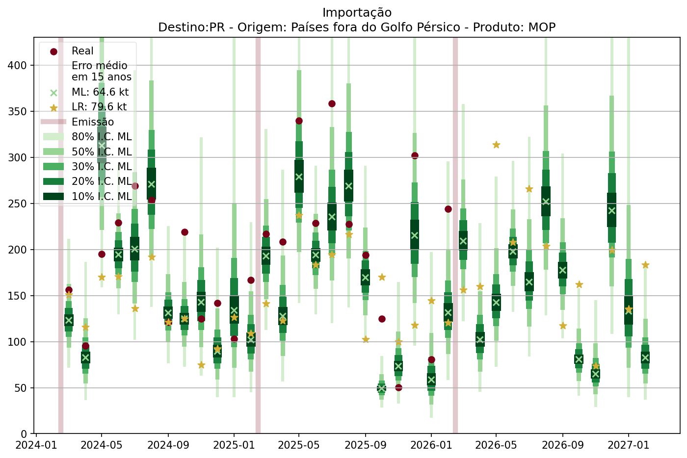  

* O tamanho da marca "X verde" é proporcional à probabilidade de a instância ocorrer.  
* Os testes foram realizados sobre o histórico disponível, podendo alcançar até 15 anos de dados, conforme a série considerada.  

---

### Análise mês a mês

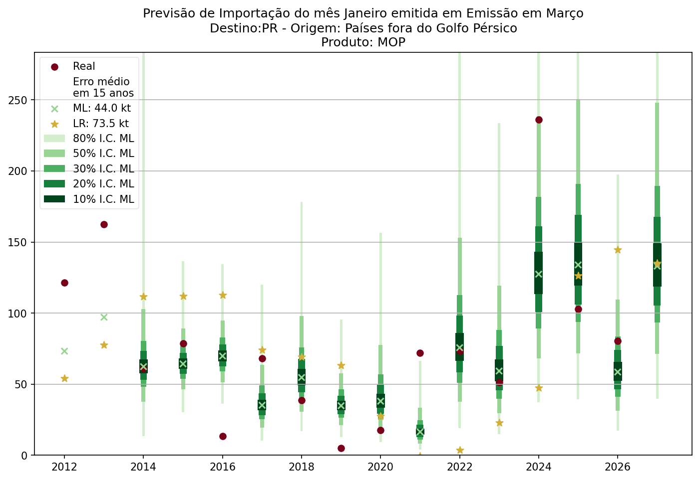
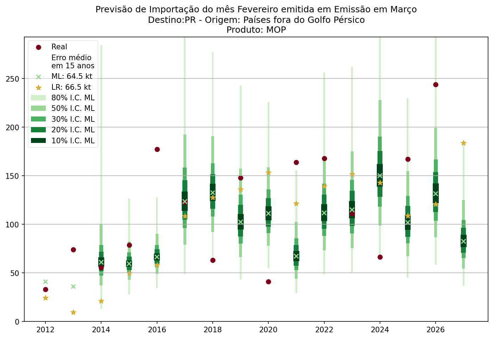
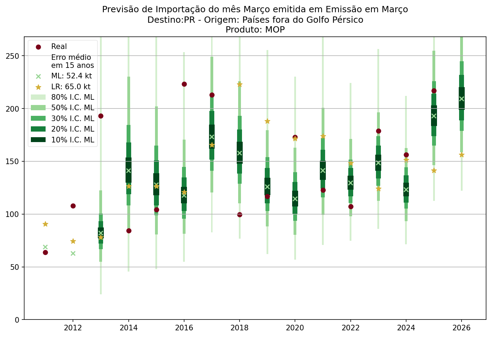
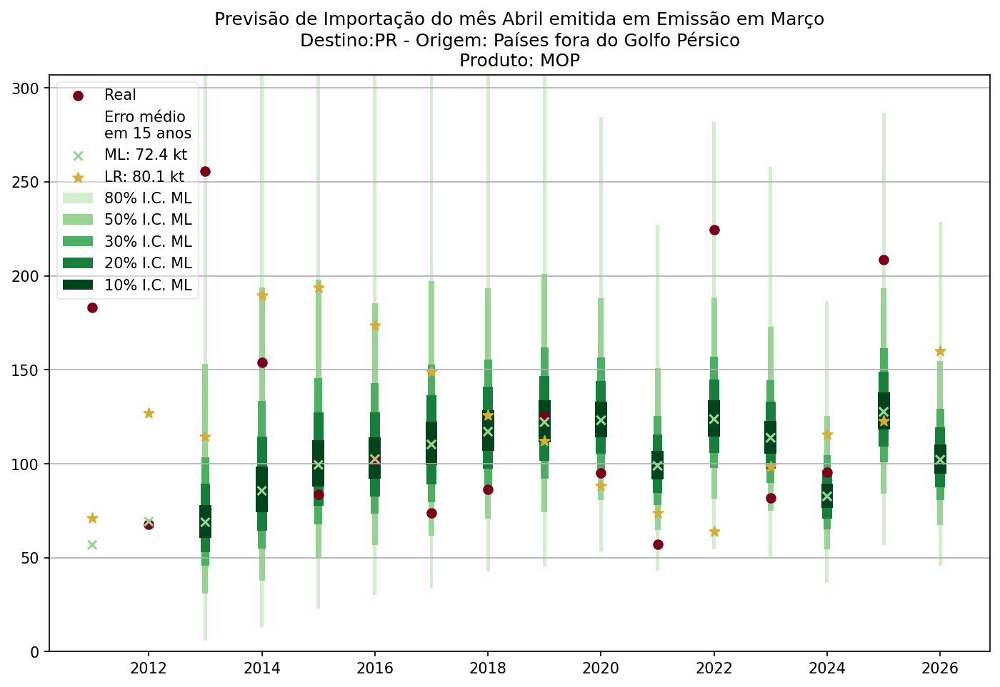
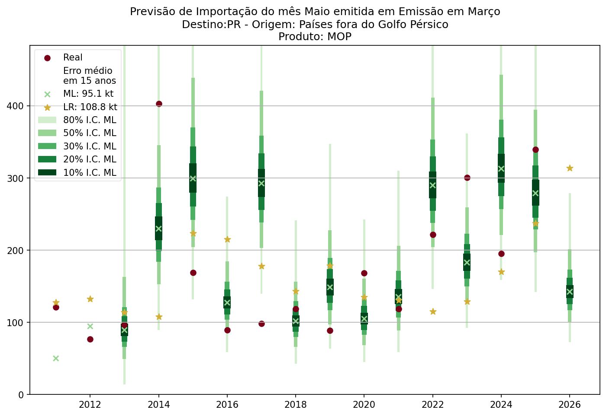
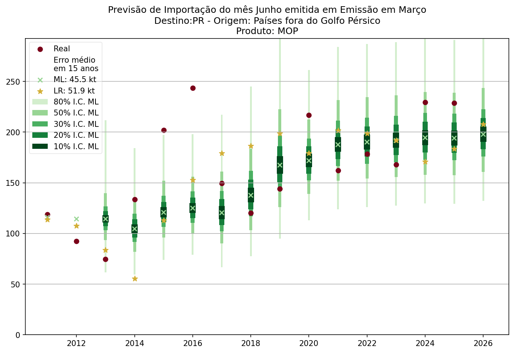
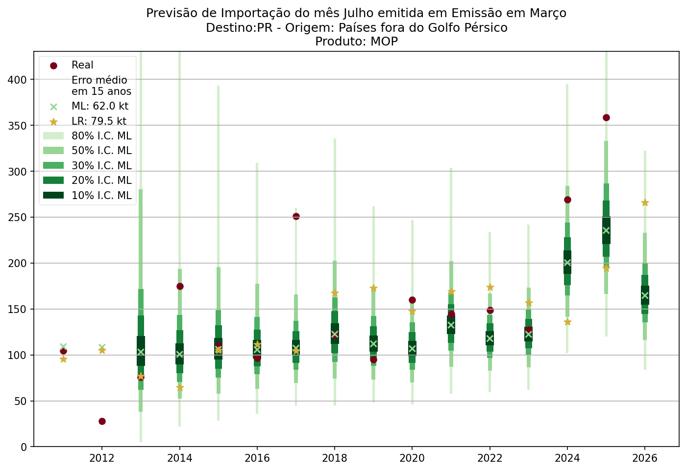
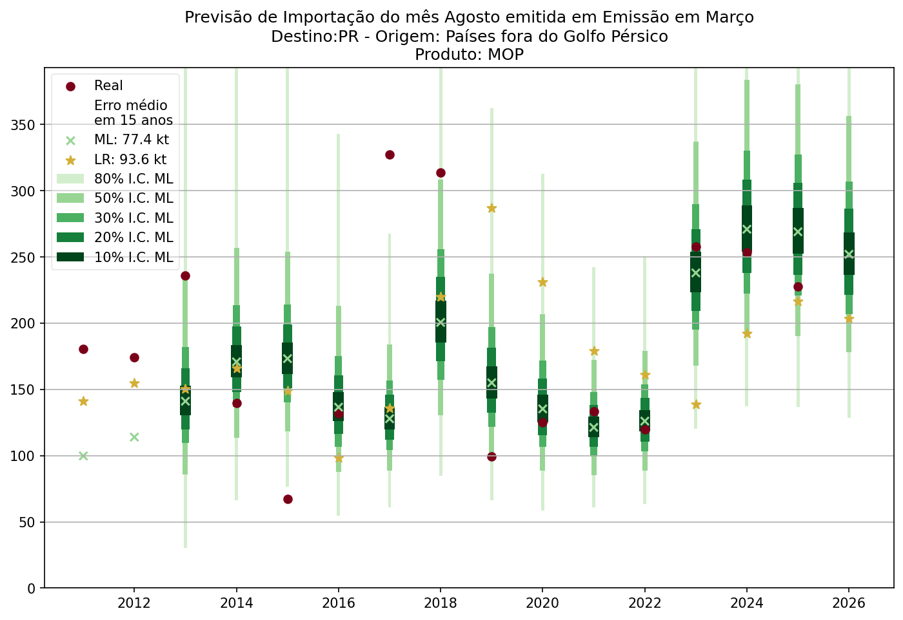
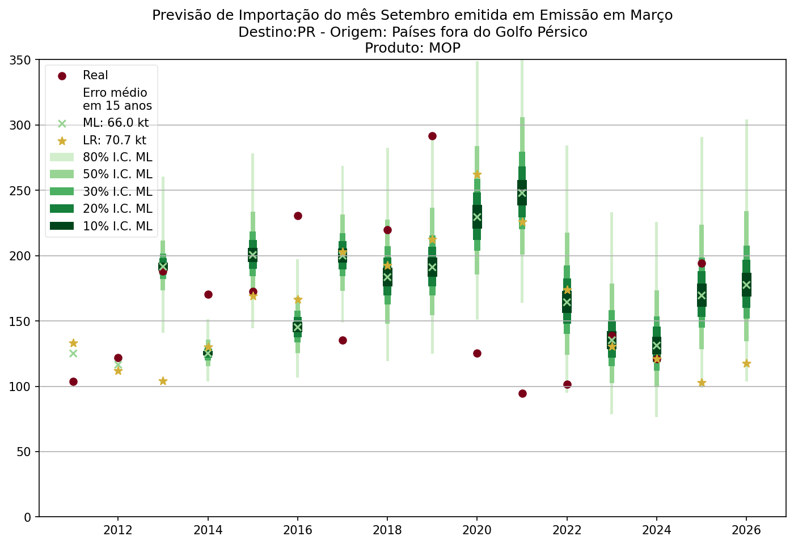
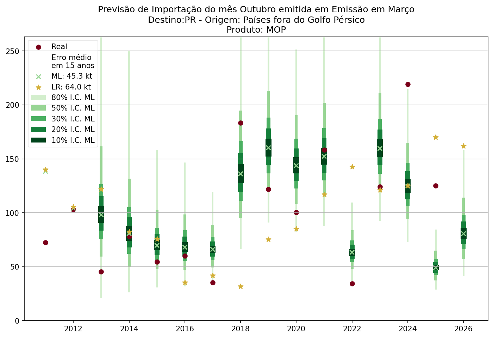
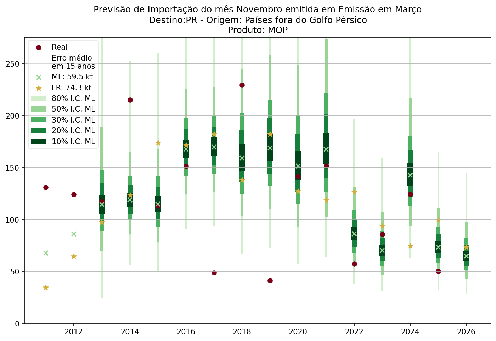
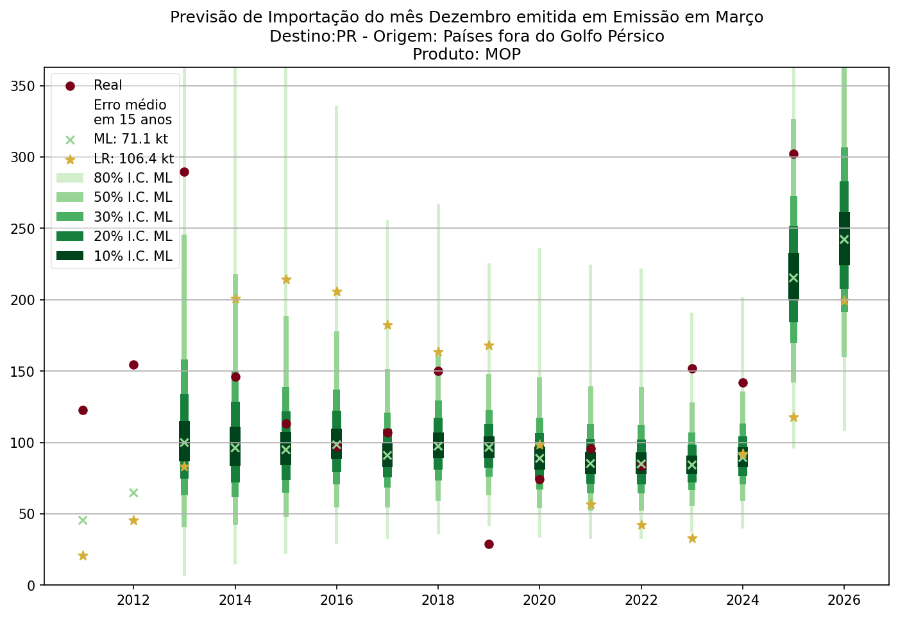

